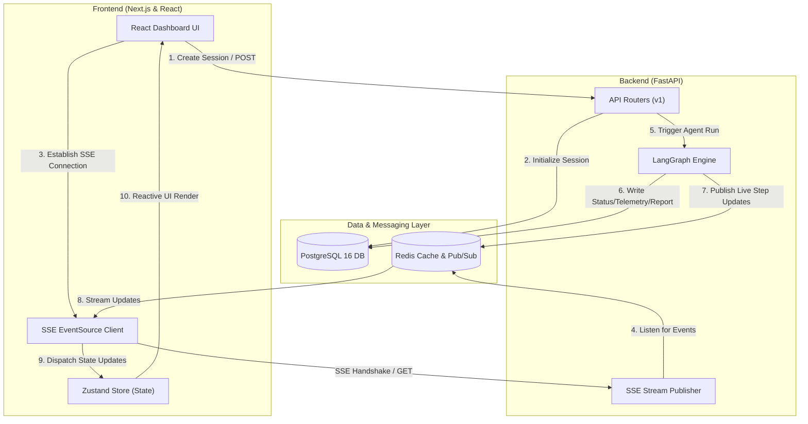
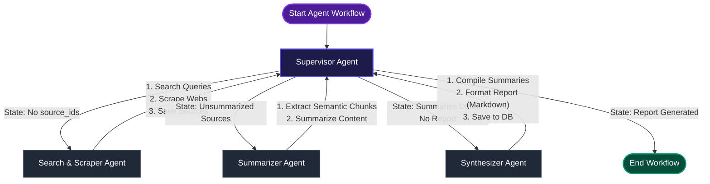

# Deep Research Platform

> **Enterprise AI Research Agent Platform**
> LangGraph + FastAPI + Next.js + Redis + PostgreSQL + SSE

---

## 🏗️ System Architecture

The Deep Research Platform is built as a **Modular Monolith** adhering to Clean Architecture principles. It features real-time agent telemetry stream integration via Server-Sent Events (SSE).



---

## 🤖 LangGraph Agent Workflow

The backend leverages a LangGraph state machine directed by a **Supervisor Agent** acting as an orchestrator. The supervisor evaluates the state at each step and routes execution dynamically.



---

## 📁 Repository Structure

```
deep-research/
├── backend/          # FastAPI async backend (Python 3.12+)
├── frontend/         # Next.js App Router (TypeScript)
├── shared/           # Cross-platform contracts & constants
├── infrastructure/   # Service configs (Nginx, Postgres, Redis)
├── scripts/          # Automation & CI/CD scripts
└── docker-compose.yml
```

---

## 🚀 Quick Start

### Prerequisites

- Python 3.12+
- Node.js 20+
- Docker & Docker Compose
- Make (optional, for ergonomics)

### Setup

```bash
# 1. Clone and setup
make setup

# 2. Start infrastructure (Postgres + Redis)
make infra-up

# 3. Run database migrations
make migrate

# 4. Start development servers
make dev
```

Or run everything inside Docker containers:

```bash
docker compose up --build
```

### Access Points

| Service  | URL                                 |
| -------- | ----------------------------------- |
| Frontend | http://localhost:4000               |
| Backend  | http://localhost:8000               |
| API Docs | http://localhost:8000/docs          |
| Health   | http://localhost:8000/api/v1/health |

---

## 🛠️ Development Tools

```bash
make help        # Show all available commands
make dev         # Start all dev servers
make lint        # Run all linters
make format      # Format all code
make test        # Run all tests
make migrate     # Run database migrations
make clean       # Clean generated files
```

---

## 💎 Design & Architecture Principles

- **Modular Monolith** — Feature-based modules with clear boundaries.
- **Clean Architecture** — Segmented layers: API ➔ Service ➔ Repository ➔ Infrastructure.
- **SOLID Principles** — Strict single responsibility and dependency inversion.
- **Event-Driven Telemetry** — Async publisher/subscriber pattern with Redis backplane.
- **Robust Markdown Rendering** — Renders real-time report compiles safely via standard `react-markdown`.
- **Type-safe Contracts** — Pydantic v2 validation schemas on backend, strict TypeScript on frontend.

---

## ⚙️ Environment Configuration

Copy `.env.example` to `.env` and configure:

```bash
cp .env.example .env
```

Supports three environments: `development`, `staging`, `production`

---

## 📊 Technical Stack

| Layer    | Technology                           |
| -------- | ------------------------------------ |
| Backend  | FastAPI, SQLAlchemy 2.x, Pydantic v2 |
| Frontend | Next.js 15, TypeScript, TailwindCSS  |
| Database | PostgreSQL 16+                       |
| Cache    | Redis 7+                             |
| Infra    | Docker, Docker Compose, Nginx        |
| Agents   | LangGraph Orchestrator               |

---

## 📄 License

Built by CiaoRaviRaj — © 2026 All rights reserved.
