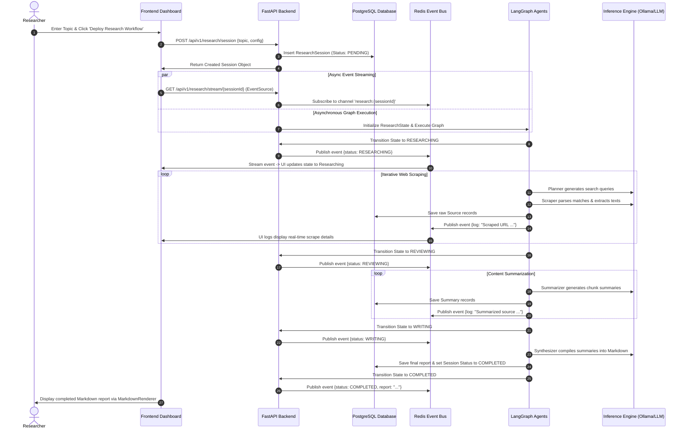

# Deep Research Platform — System & Architecture Guide

> **Official System Guide and Technical Documentation**
> Authored for developers, architects, and operators of the AI Deep Research Engine.

---

## 📖 Overview

The Deep Research Platform is an enterprise-grade agentic search console that orchestrates autonomous AI workflows. It scrapes web pages, extracts semantic insights, compiles intelligence summaries, and streams execution logs to the user's dashboard in real-time.

---

## 🛠️ Technology Stack

The platform is designed around a **modular monolith** style, separating responsibilities into well-defined backend, frontend, database, and caching boundaries.

| Layer | Technology | Purpose & Rationale |
| :--- | :--- | :--- |
| **Frontend** | Next.js 15 (App Router) | Client-side dashboard, server rendering, dynamic routing, and typed routing validation. |
| | React 19 & TypeScript | Strict type-safety, modular component design, and interface rendering. |
| | Tailwind CSS | Sleek, custom high-contrast dark theme with premium color tokens. |
| | Zustand | Client state container managing session details, history state, and telemetry. |
| **Backend** | FastAPI (Python 3.12+) | High-performance asynchronous API framework utilizing ASGI. |
| | LangGraph | State-machine based orchestrator coordinating the agent network. |
| | SQLAlchemy 2.0 (asyncpg) | Object-Relational Mapper executing async database operations. |
| | Pydantic v2 | High-performance data parsing, validation, and serialization. |
| **Storage** | PostgreSQL 16 | Relational store persisting sessions, sources, summaries, and audit logs. |
| **Caching/PubSub**| Redis 7 | Event broker for live SSE message streaming and state caching. |
| **Runtime** | Docker & Compose | Deterministic containerization of application services. |

---

## 🏗️ System Architecture

The following diagram details the network layers, request handling pathways, and the asynchronous event loop driving live progress streams.

```mermaid
graph TD
    subgraph Client ["Client (React & Next.js)"]
        UI["React Dashboard Page"]
        ZS["Zustand Store (UI State)"]
        SSE_C["SSE EventSource Client"]
    end

    subgraph API ["Web Server (FastAPI)"]
        RTR["API Route Controllers"]
        SSE_S["SSE Event Stream Publisher"]
        LGE["LangGraph Agent Engine"]
    end

    subgraph DB ["Data / Messaging Backplanes"]
        PG[(PostgreSQL 16 DB)]
        RD[(Redis Cache & Pub/Sub)]
    end

    UI -->|1. Create Session / POST| RTR
    RTR -->|2. Write Pending Session| PG
    UI -->|3. Establish SSE Connection| SSE_C
    SSE_C -->|SSE Handshake / GET| SSE_S
    SSE_S -->|4. Subscribe to Session Channel| RD
    RTR -->|5. Launch LangGraph Run (Async Task)| LGE
    LGE -->|6. Write Logs & Research Reports| PG
    LGE -->|7. Publish Live Telemetry & Status| RD
    RD -->|8. Push Stream Message| SSE_C
    SSE_C -->|9. Dispatch State Action| ZS
    ZS -->|10. Reactive UI Re-render| UI
```

---

## 🔄 Data Flow Lifecycle

This sequence illustrates the lifecycle of a query from the initial click to the final compiled Markdown report.



---

## 📁 Repository Directory Structure

```
deep-research/
├── backend/
│   ├── app/
│   │   ├── api/                # API Routers (v1)
│   │   │   ├── endpoints/      # Controllers (health, research sessions)
│   │   │   └── router.py       # Main API router registry
│   │   ├── core/               # Application configuration & system constants
│   │   ├── graph/              # LangGraph orchestration state machine
│   │   │   ├── agents/         # Agents: Supervisor, Search, Summarizer, Synthesizer
│   │   │   ├── state.py        # Shared Graph State schemas
│   │   │   └── workflow.py     # Graph compiler & node linkage
│   │   ├── models/             # SQLAlchemy declarative models
│   │   ├── repositories/       # Data Access Object pattern
│   │   └── services/           # Business logic (database sessions, streaming, LLM clients)
│   ├── tests/                  # Backend unit & integration test suites
│   └── Dockerfile              # Python Docker configuration
├── frontend/
│   ├── public/                 # Static assets (logo.png, favicon.ico)
│   ├── src/
│   │   ├── app/                # Next.js page routes & layouts
│   │   │   ├── reaseach/       # Dynamic workspace views (/reaseach/:id)
│   │   │   ├── privacy/        # Privacy Policy page
│   │   │   ├── legal/          # Legal Notice page
│   │   │   ├── layout.tsx      # Root HTML wrapper
│   │   │   └── page.tsx        # Homepage dashboard console
│   │   ├── components/         # Reusable React components
│   │   │   ├── health/         # Telemetry health indicators
│   │   │   ├── research/       # Form, Lists, Workspace detail widgets
│   │   │   └── Footer.tsx      # Shared platform footer component
│   │   ├── config/             # Config variables (API endpoints)
│   │   ├── store/              # Zustand global store definitions
│   │   └── types/              # TS interface definitions
│   ├── Dockerfile.dev          # Dev mode Next.js Docker config
│   └── tailwind.config.js      # Styling guidelines and custom colors
├── shared/                     # Cross-platform JSON schemas & validation schemas
├── infrastructure/             # Docker Compose networks & service configurations
└── docker-compose.yml          # Top-level orchestrator for local deployments
```

---

## ⚙️ Environment Variables & Config Flags

Both services are configured via environment files. Copy `.env.example` to `.env` to customize settings.

### Backend Configuration
* `DATABASE_URL`: Asynchronous connection URI for PostgreSQL.
* `REDIS_URL`: Connection string for Redis cache and Pub/Sub.
* `OLLAMA_BASE_URL`: API address for local LLM inference engines (default: `http://localhost:11434`).
* `MODEL_NAME`: The model registry identifier (default: `gemma-2-9b-it`).
* `SELENIUM_HUB_URL`: Grid endpoint for autonomous browser-based scrapers.

### Frontend Configuration
* `NEXT_PUBLIC_API_URL`: Root API connection endpoint pointing to the backend.

---

## 🛠️ Step-by-Step Developer Setup

Follow this protocol to boot the system for local development.

### 1. Build and Run Infrastructure
Boot Postgres and Redis using the Compose stack:
```bash
docker compose up -d db redis
```

### 2. Prepare the Backend
Navigate to `backend/`, initialize your virtual environment, and install dependencies:
```bash
cd backend
python -m venv .venv
source .venv/bin/activate
pip install -r requirements.txt
```

Run database migrations to generate required schemas:
```bash
alembic upgrade head
```

Start the FastAPI application:
```bash
uvicorn app.main:app --host 0.0.0.0 --port 8000 --reload
```

### 3. Prepare the Frontend
Navigate to `frontend/`, install node modules, and boot the Next.js dev server:
```bash
cd frontend
npm install
npm run dev
```

The console is now live at [http://localhost:4000](http://localhost:4000).

---

## 🧪 Testing Protocol

The backend features standard testing capabilities via pytest.

```bash
# Run unit and integration tests
cd backend
pytest tests/
```

Run type and lint audits on both services to guarantee clean commits:
```bash
# Backend lints
cd backend
flake8 app/
mypy app/

# Frontend lints
cd frontend
npm run type-check
npm run lint
```

---

## 📄 License & Footers

The platform contains standard copyright compliance banners.
* **Metadata & Linkage**: Layout footers map to `/privacy` and `/legal` respectively.
* **Ownership**: `Built by CIaoRaviRaj — © 2026 All rights reserved.`
